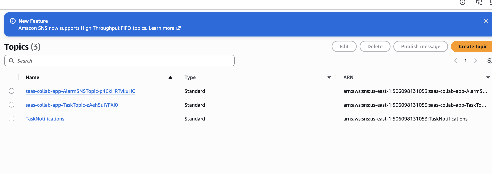

# 🚀 SaaS Collaboraation Task Management Platform(AWS Serverless)
AWS Serverless | Event-Driven Architecture | CI/CD (GitHub Actions) | Full-Stack SaaS

A production-ready, event-driven SaaS application built using AWS Serverless technologies, featuring authenitcation,workspace collaboration, task management, file uploads,CI/CD automation and monitoring.

## 🌐 System Architecture

### Architecture Diagram:
 

User
 ↓
CloudFront (Frontend Hosting)
 ↓
S3 (React Build Files)
 ↓
API Gateway (HTTP API)
 ↓
Lambda (Business Logic)
 ↓
DynamoDB (Database)
 ↓
SQS (Event Queue)
 ↓
Lambda Consumer
 ↓
SNS (Notifications)
 ↓
Email Alerts

Monitoring:
CloudWatch Logs + Alarms

## ✨ Key Features

### 👤 Authentication
 - AWS Cognito login (OAuth2)
 - JWT token-based secure API access
 - Protected backend routes

### 🗂️ Workspace Management
 - Create/Delete multiple workspaces
 - Workspace-based task separation
 - Role-based access(Admin/User)
 - Multi-user collaboration

### ✅ Task Management
 - Create / Update / Delete tasks
 - Status tracking:
          - TODO
          - IN_PROGRESS
          - DONE
 - File attachments via S3

### 📎 File Upload System
 - Secure pre-signed S3 upload URLs
 - Direct browser-to-S3 upload
 - Task-based file association

### 🔔 Notification System (Event Driven)
 - SQS-based event queue
 - Lambda consumer processes events
 - SNS sends email notifications:
          - Task Created
          - Task Updated
          - Task Deleted

### ⚙️ CI/CD Pipeline
 - GitHub Actions automation
 - Backend deployed via AWS SAM
 - Frontend built with Vite
 - S3 deployment + CloudFront invalidation
 - Fully automated deployment pipeline

## 🔄 Full System Flow (End-to-End)

### 🔐 Authentication Flow
User → Cognito Login → Access Token (JWT)

### 🧠 Core Application Flow
1. User logs in (Cognito)
2. Frontend receives JWT token
3. User calls API (Create Task)
4. API Gateway triggers Lambda
5. Lambda stores data in DynamoDB
6. Lambda publishes event to SQS
7. Consumer Lambda processes SQS message
8. SNS sends email notification
9. CloudWatch logs all events

## 🏗️ Detailed Event Flow

### Example: Create Task

Login → Get JWT Token
        ↓
POST /tasks API Call
        ↓
API Gateway
        ↓
Lambda (Task Service)
        ↓
DynamoDB (Store Task)
        ↓
SQS (Task Event Published)
        ↓
Consumer Lambda
        ↓
SNS Topic
        ↓
Email Notification Sent

## 🏗️ Project Structure

saas-collab-app/
│
├── src/
│   ├── workspace-service/
│   ├── task-service/
│   ├── members-service/
│   ├── upload-url/
│   ├── download-url/
│   └── consumer-service/
│
├── frontend/
│   └── (React App)
│
├── template.yaml
├── .github/workflows/deploy.yml
└── README.md

## ⚙️ Setup Instructions

### 1️⃣ Backend Setup (AWS SAM)
sam build
sam deploy
 - After deployment, note:
          * API URL
          * Cognito Login URL
          * S3 Bucket Name
          * CloudFront URL

### 2️⃣ Frontend Setup (React)
cd frontend
npm install
npm run build

### Run Locally (optional)
npm run dev

### 3️⃣ Deploy Frontend to S3
aws s3 sync dist/ s3://your-bucket-name --delete

### 4️⃣ CloudFront Cache Refresh
aws cloudfront create-invalidation \
--distribution-id YOUR_DISTRIBUTION_ID \
--paths "/*"

## Lambda Environment
TASKS_TABLE
WORKSPACE_TABLE
MEMBERS_TABLE
UPLOAD_BUCKET
SQS_QUEUE_URL
SNS_TOPIC_ARN

## 📊 Monitoring & Observability
 - CloudWatch Logs for all Lambda functions
 - SNS email alerts for task events
 - Event traceability through SQS
 - Debuggable serverless pipeline

## ⚠️ Challenges Faced

### 🔐 Authentication Complexity

  - Managing Cognito JWT tokens between frontend and API Gateway required careful handling of redirect URIs and token extraction.

### 🌐 CORS & API Integration
  - Faces preflight request failures
  - Fixed by: 
        * Adding OPTIONS ROUTE
        * Disabling auth for OPTIONS
        * Correct APi Gateway CORS config

### ☁️ S3 + CloudFront Deployment Issues

  - React build deployment required correct handling of dist/ folder and cache invalidation strategies for updates to reflect properly.
  - S3 Bucket not accesible:
  - Fixed by:
        * Origin Access Control(OAC)
        * Proper Permissions

### 🔄 Event-Driven Debugging

  - Ensuring proper message flow across SQS → Lambda → SNS required debugging event structure and JSON parsing consistency.

### ⚙️ CI/CD Pipeline Issues

  - GitHub Actions required debugging:
        * Node version mismatch in build environment
        * Deployment ordering (backend before frontend)
        * Missing secrets configuration
    
## 📦 Build & Sync Issues

Handling Vite build output and ensuring correct S3 sync path (dist/) was critical for frontend deployment success.

## 🧪 What I Learned
 - Designing scalable serverless architectures
 - Event-driven system design patterns
 - AWS SAM Infrastructure as Code
 - CI/CD automation using GitHub Actions
 - Secure authentication using Cognito + JWT
 - CloudFront + S3 hosting patterns
 - Distributed system debugging in AWS

## 🛠️ Tech Stack

### Frontend
 - React (Vite)
 - Axios
 - React Router
### Backend
 - AWS Lambda (Node.js)
 - API Gateway HTTP API
 - DynamoDB
 - AWS Services
 - Cognito
 - S3
 - CloudFront
 - SQS
 - SNS
 - CloudWatch
### DevOps
 - AWS SAM (IaC)
 - GitHub Actions (CI/CD)

## 📸 Screenshots
### Front end 

#### Login with cognito

#### Dashboard & Workspace View (from Cloudfront Network)

### API FLOW
 #### Authorization Header with Token
 

 #### New Workspace created
 

 #### New Task created
 

#### Postman Request-API Works

### Terminal Outputs

#### Result of Sam build & Sam deploy

#### npm build done and further steps

### GitHub Actions(CI/CD)

### Monitoring

#### Cloudwatch Logs-Consumer Lambda

### CloudFormation Stack Created Resources:

#### Stack created

#### SQS & DLQ

#### SNS

#### Lambda functions created by AWS SAM & Myself

#### API Gateway

## 🚀 Deployment

### Backend
sam build
sam deploy

#### Frontend
npm run build
aws s3 sync dist/ s3://bucket-name --delete

## 🚀 Future Improvements

* Add refresh token handling
* Role-based UI
* Real-time updates (WebSockets)
* Pagination & search
* Custom domain with HTTPS
* Multi-tenant isolation improvements

## 🤝 Contribution

Feel free to fork, improve, and contribute!

## 💡 Final Note

This project demonstrates real-world cloud engineering skills including:

* System design
* Security
* Scalability
* Automation
* Debugging

## 👨‍💻 Author

### FATHIMA YOSRA AJEEB
